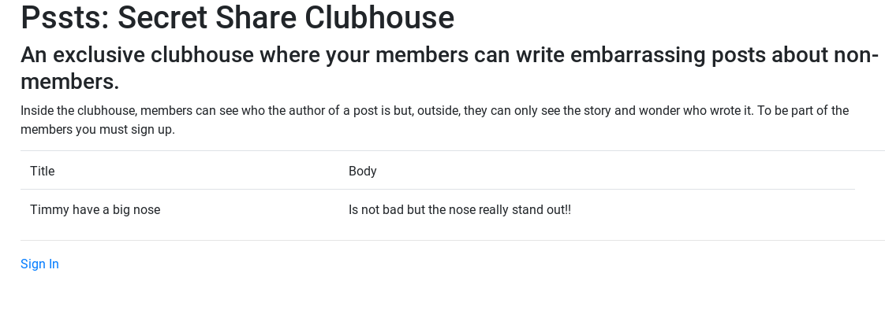
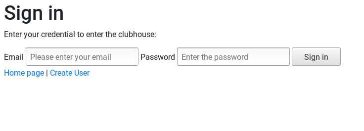
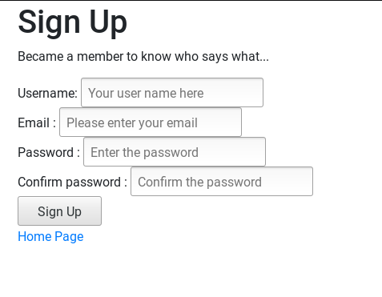
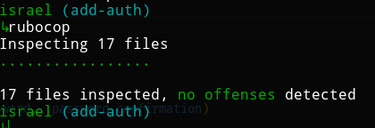

<!-- PROJECT SHIELDS -->
<!--
*** I'm using markdown "reference style" links for readability.
*** Reference links are enclosed in brackets [ ] instead of parentheses ( ).
*** See the bottom of this document for the declaration of the reference variables
*** for contributors-url, forks-url, etc. This is an optional, concise syntax you may use.
*** https://www.markdownguide.org/basic-syntax/#reference-style-links
-->
[![Contributors][contributors-shield]][contributors-url]
[![Forks][forks-shield]][forks-url]
[![Stargazers][stars-shield]][stars-url]
[![Issues][issues-shield]][issues-url]
[![MIT License][license-shield]][license-url]

<!-- PROJECT LOGO -->
 

  

  <h3 align="center">
	Members Only
  </h3>

  

    Pssts is an exclusive clubhouse where members can write embarrassing posts about non-members. Inside the clubhouse, members can see who the author of a post is but, outside, they can only see the story and wonder who wrote it.
     
    <a href="https://github.com/raheebwa/members-only/blob/develop/README.md"><strong>Explore the docs 📚</strong></a>
     
     
	  🖊️
    <a href="https://www.theodinproject.com">Assigment</a>
    🐛
    <a href="https://github.com/raheebwa/members-only/issues">Report Bug</a>
    🙏
    <a href="https://github.com/raheebwa/members-only/issues">Request Feature</a>
  

# Mastering Auth without gems in Rails
Building a basic Authorization and Authentification System from the ground up to use in a Micropost APP.

# Validations

Rubocop: 

# Features

* Using different databases for development (sqlite3) and production (postgres)
* Followed the tutorial
* Added session and cookie tokens
* Tests made with [`RSpec`](https://relishapp.com/rspec/)

# Built With

* `ruby` v2.5.5
* `rails` v5.2.3+
* RVM
* `vscode` with _Ruby_ and _Rubocop_ extensions
* Linux
* Love and Passion for code.

# Authors

* [Aheebwa Ramadhan](https://github.com/raheebwa)
* [Israel Laguan](https://github.com/Israel-Laguan)

# License

This project is licensed under the MIT License - see the [LICENSE.md](LICENSE.md) file for details 

<!-- ACKNOWLEDGEMENTS -->
## Acknowledgements
* [Microverse](https://www.microverse.org/)
* [The Odin Project](https://www.theodinproject.com/)
* [Readme header author](https://github.com/collinsugwu/Microverse201-Enumerable-Methods)

<!-- MARKDOWN LINKS & IMAGES -->
<!-- https://www.markdownguide.org/basic-syntax/#reference-style-links -->
[contributors-shield]: https://img.shields.io/github/contributors/raheebwa/members-only.svg?style=flat-square
[contributors-url]: https://github.com/raheebwa/members-only/graphs/contributors
[forks-shield]: https://img.shields.io/github/forks/raheebwa/members-only
[forks-url]: https://github.com/raheebwa/members-only/network/members
[stars-shield]: https://img.shields.io/github/stars/raheebwa/members-only
[stars-url]: https://github.com/raheebwa/members-only/stargazers
[issues-shield]: https://img.shields.io/github/issues/raheebwa/members-only
[issues-url]: https://github.com/raheebwa/members-only/issues
[license-shield]: https://img.shields.io/github/license/raheebwa/members-only
[license-url]: https://github.com/raheebwa/members-only/blob/master/LICENSE.txt